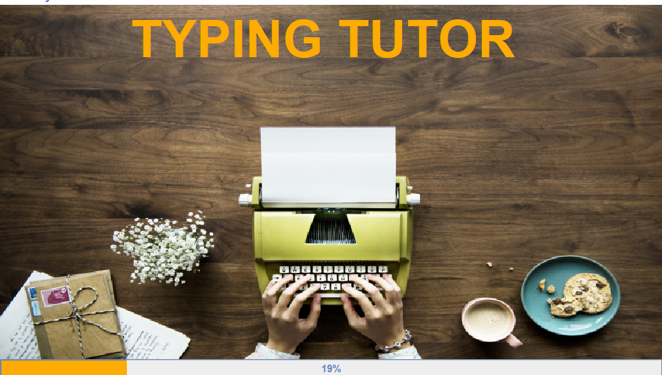
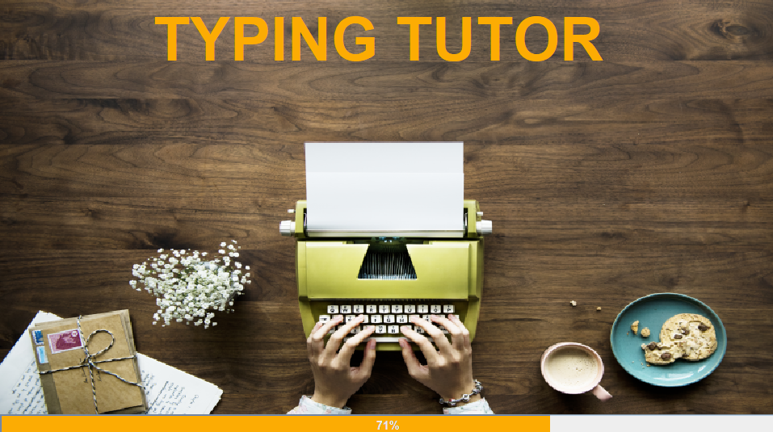
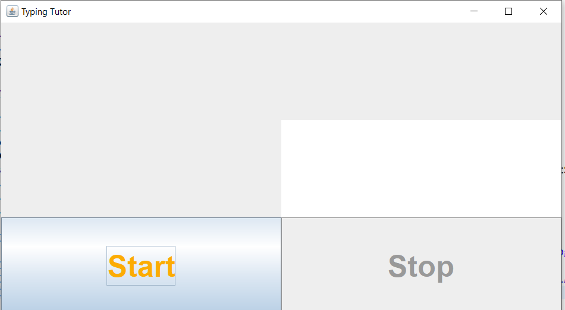
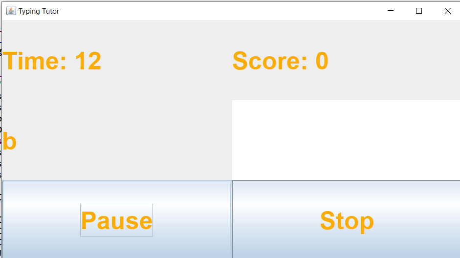
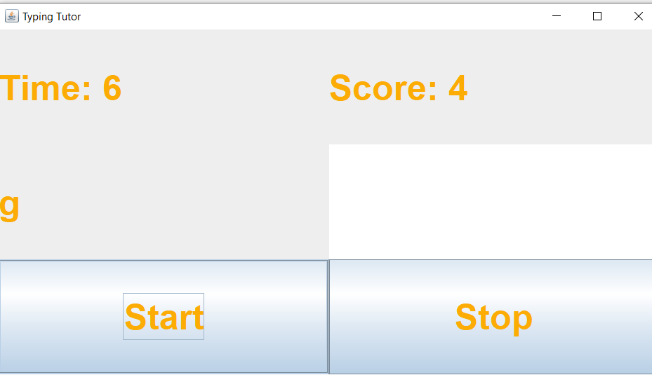
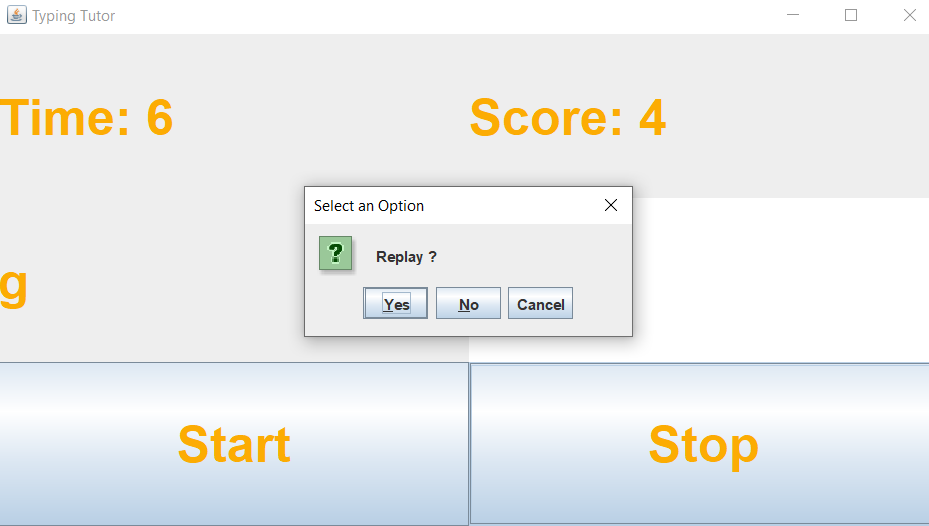

# **TypingTutorGame**
### If you just want to play the game then download the .jar file present in TheGame folder or [_From this link_](https://github.com/oxoMkoxo/TypingTutorGame/blob/master/TheGame/TypingTutor.jar). If your browser shows warning click `keep` and then `run` it. 

<br><br><br>
The traditional typing tutors are designed for vast section of society. But it is not necessary for a programmer to know all these traditional typing techniques. Moreover, these traditional typing practices are exhausting and tiring. With each passing lesson, user starts losing interest and it all gets very boring and monotonous.
Our project is very useful and it provides an interesting way to learn typing. User is no longer required to go through long and boring typing lessons.

<br><br><br><br>

## SCREENSHOTS WITH WORKING

### 1.

</img>
```
Screenshot 1: Splash Screen at 19%
```
This is the first screen of my project. This screen is called Splash Screen. It shows a
Progress Bar which starts from 0 and goes till 100%.

</img>
```
Screenshot 2: Splash screen at 71%
```

### 2.

</img>
```
Screenshot 3: Start screen
```
This is the second screen. It comes just after splash screen in a new window. This screen
is added to let user get ready for the game. Whenever he/she is ready, the game can be
proceeded by clicking start.

### 3.

</img>
```
Screenshot 4: Game-play Stage Area screen
```

The Screen at figure 9 shows the Game-play Stage Area where the game is played.

It consists of options like:

- Pause-Option Button
- Stop-Option Button
- Time Display Label
- Score Display Label
- Flashing-Character box Label
1. Pause-Option Button: It stops the game time and characters flashing
temporarily. Once the Pause-Button is clicked, it gets converted to Start button
for further movement in game. User can start the game again by click start.

</img>
```
Screenshot 5: Functioning of Pause Button
```
2. Stop-Option Button: It stops the game. When this button is clicked, it displays
    an option pane dialog box asking user whether he/she wants to replay the game
    or not.

</img>
```
Screenshot 6: Replay Option Pane Dialog Box
```
3. Time Display Label: It shows the time left in seconds. The game is setup with
    time limit of 15 seconds. By each passing second it decreases.
4. Score Display Label: It shows the score at Realtime. The game is setup with
    score as 0 and with each correctly matching character it increases by one. The
    maximum score is 15.
5. Flashing-Character Box Label: It shows the character to be typed. The character
    can be any random alphabet generated randomly.
